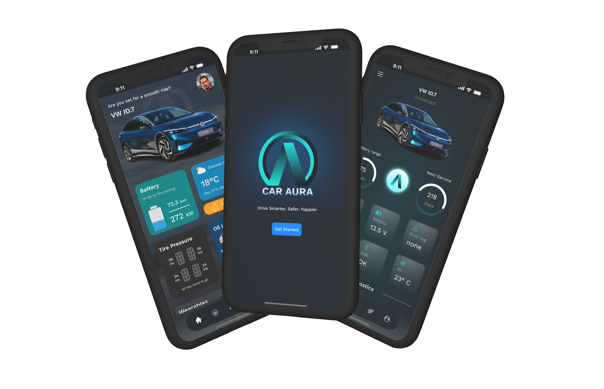
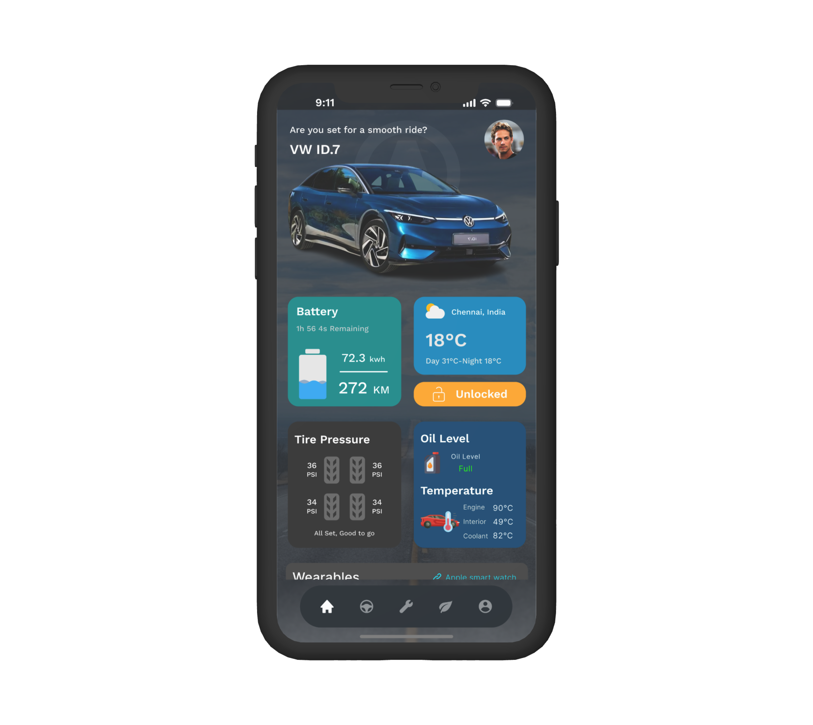
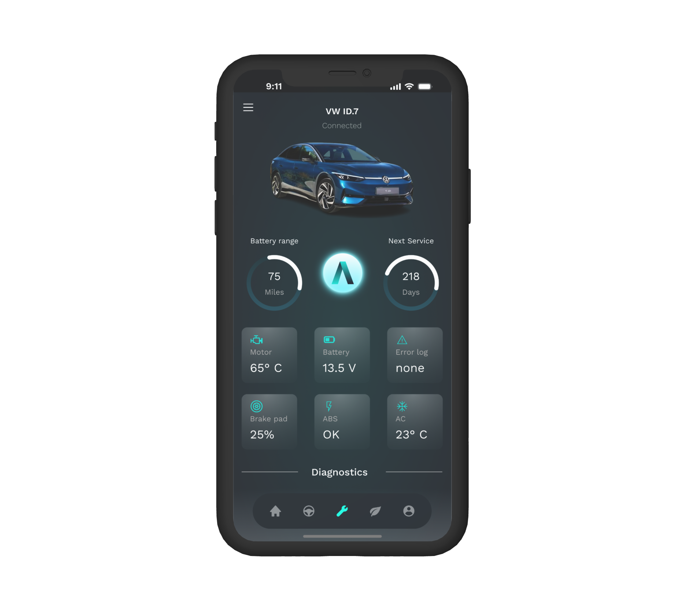
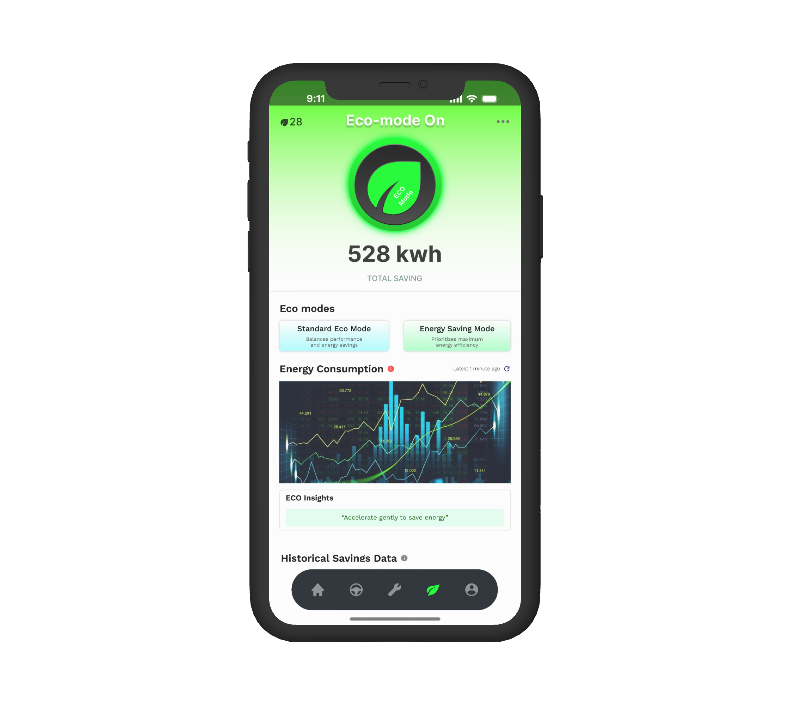
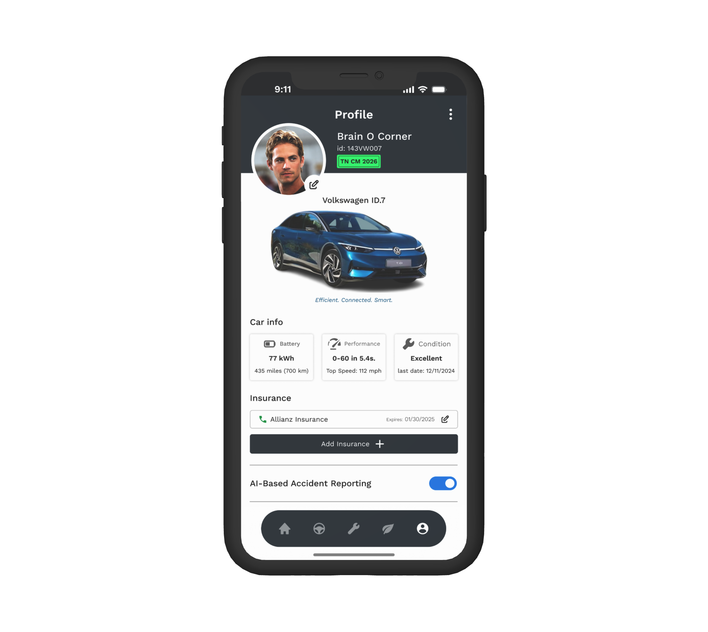

# **CarAura - Revolutionizing the Driving Experience**

CarAura is a comprehensive mobile application prototype designed to enhance vehicle management, improve driving efficiency, and prioritize driver safety. This app provides a user-friendly interface and powerful features tailored for electric vehicles (EVs) and compatible with traditional cars.



---

## **Features**

### 1. **Home Screen**

- Overview of the car's health status, displayed through color-coded indicators (Green: Healthy, Yellow: Attention Needed, Red: Critical).
- Driver wellness tracking with wearable device integration.
- Real-time vehicle location tracking for added security.



---

### 2. **Drive Mode Screen**

- Integrated navigation system with route planning and live traffic updates.
- Smart Parking Assistance to find parking spots along your route or at your destination.
- Real-time eco-driving tips to optimize energy consumption and driving efficiency.
- Quick controls for ambient lighting, climate settings, and media playback.


---

### 3. **Diagnostics Screen**

- Comprehensive vehicle diagnostics covering key systems (e.g., tires, brakes, battery).
- AI-powered predictive maintenance suggestions based on historical and real-time data.
- Review of completed maintenance records and quick service scheduling options.



---

### 4. **Eco Mode Screen**

- Real-time energy usage tracking compared to eco-driving benchmarks.
- Historical data visualization of energy savings.
- Battery status, consumption rate, and estimated range (for EVs).
- Vehicle-to-Grid (V2G) energy sharing feature to contribute to the energy grid and reduce costs.



---

### 5. **Profile Screen**

- User and vehicle details management.
- Emergency incident reporting system with fraud-proof insurance claim options.
- Access to incident history and saved service records.



---

## **How It Works**

### **Technology Stack**

1. **Front-End Development**:

   - Built using [Flutter](https://flutter.dev/) for cross-platform mobile app development.
   - UI designed to prioritize ease of use and clear navigation.

2. **Back-End Services**:

   - API integration for navigation, parking, and energy management using services like Google Maps and energy-sharing APIs.
   - Simulated vehicle diagnostics and predictive maintenance using rule-based logic and mock data.

3. **AI Integration**:

   - Predictive maintenance algorithms analyze driving behavior and historical patterns.
   - Accident detection powered by accelerometer data simulators.

4. **Third-Party APIs**:
   - Smart Parking Assistance: Integrates APIs like [Google Maps](https://developers.google.com/maps/documentation) or [Mapbox](https://www.mapbox.com/).
   - Energy Dashboard: Uses mock battery data for real-time visuals.

---

## **Getting Started**

### **Prerequisites**

- Install [Node.js](https://nodejs.org/) and [npm](https://www.npmjs.com/).
- Install [Expo CLI](https://docs.expo.dev/) for React Native development.

### **Setup Instructions**

1. Clone this repository:
   ```bash
   git clone https://github.com/your-username/CarAura.git
   cd CarAura
   ```
2. Install dependencies:
   ```bash
   npm install
   ```
3. Run the app:
   ```bash
   expo start
   ```

---

## **Demo Video**

Watch the demo video showcasing the app prototype in action:  
[Demo Video Link](#) _(Replace with your video link)_

---

## **Screenshots**

| Screen      | Preview                                         |
| ----------- | ----------------------------------------------- |
| Home Screen |         |
| Drive Mode  |    |
| Diagnostics |  |
| Eco Mode    |        |
| Profile     |          |

---

## **Contributing**

We welcome contributions to improve CarAura!

1. Fork the repository.
2. Create a new branch:
   ```bash
   git checkout -b feature/your-feature-name
   ```
3. Commit your changes:
   ```bash
   git commit -m "Add your message"
   ```
4. Push to the branch:
   ```bash
   git push origin feature/your-feature-name
   ```
5. Open a pull request.

---

## **Contact**

If you have any questions or feedback, feel free to reach out to us:  
Email: [gukanranganathan@gmail.com](mailto:gukanranganathan@gmai)
